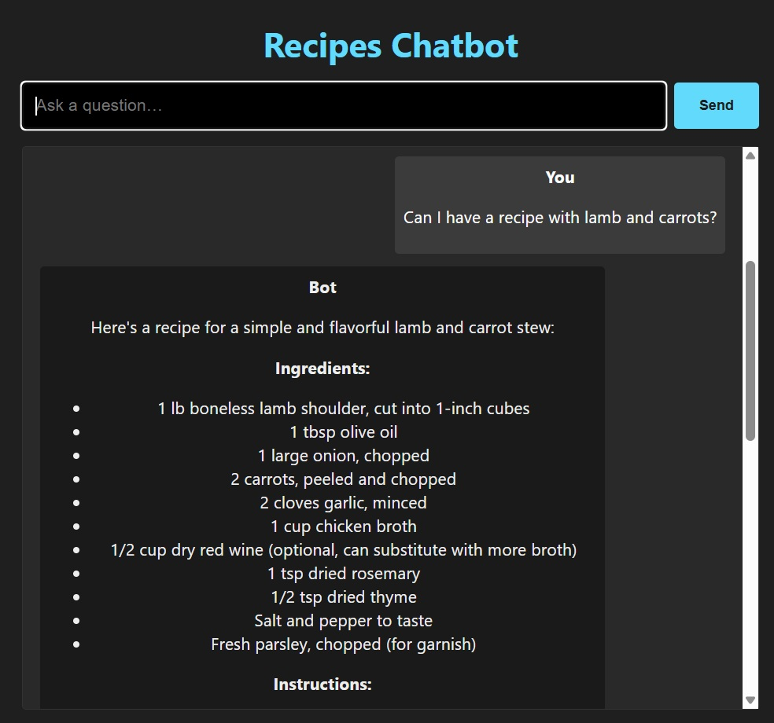
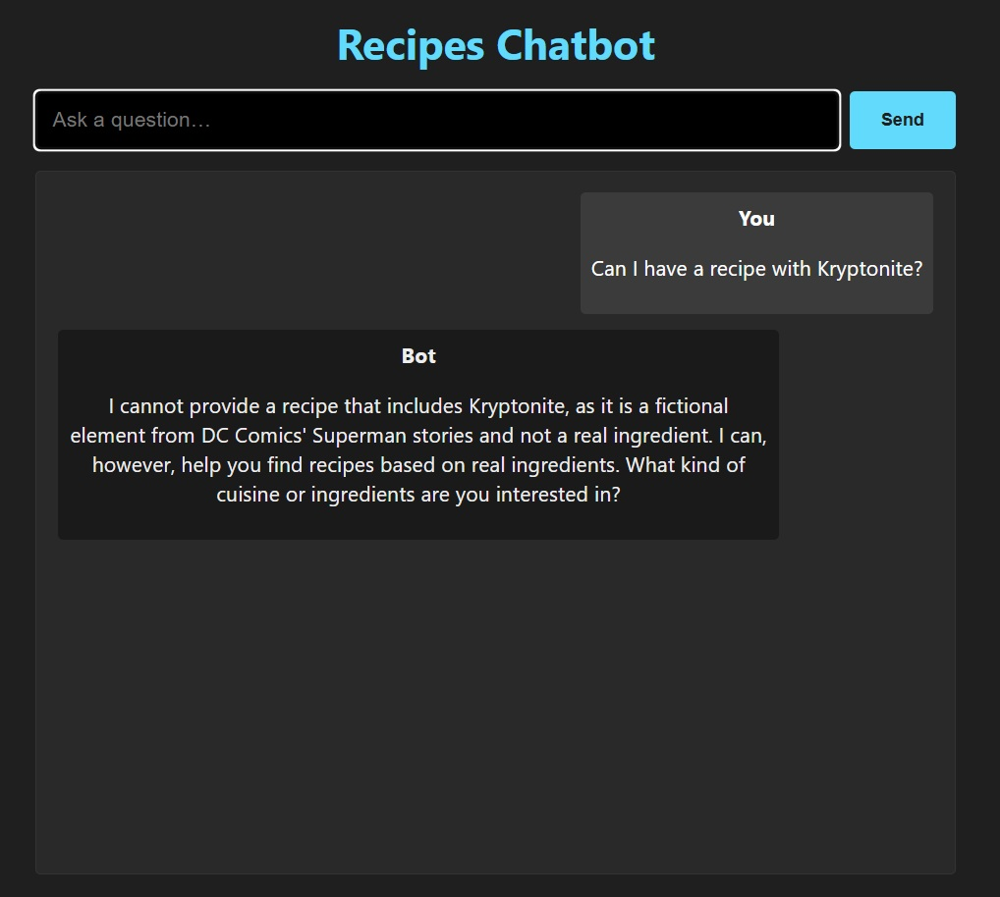

# Recipes Chatbot on Google Cloud

## Overview

The Recipes Chatbot is a full-stack application designed to help users discover recipes based on their queries. It leverages Google Cloud's Vertex AI with the Gemini 1.5 Flash model for natural language understanding and to intelligently call custom backend functions. These functions query a large dataset of over 500,000 recipes (stored as a `.parquet` file on Google Cloud Storage) using Pandas, allowing users to find recipes based on ingredients, categories, and more.

The application features a React frontend for user interaction and a FastAPI (Python) backend to handle API requests and AI logic. It is containerized using Docker and deployed scalably on Cloud Run, with the Docker image hosted on Artifact Registry.

Live Application: [https://recipes-chatbot-748269624010.europe-west2.run.app/](https://recipes-chatbot-748269624010.europe-west2.run.app/)

## Features

* **Natural Language Recipe Search:** Users can type queries in natural language (e.g., "Show me recipes with chicken and tomatoes").
* **AI-Powered Understanding:** Utilizes Gemini 1.5 Flash on Vertex AI for advanced NLP to understand user intent.
* **Intelligent Tool Use (Function Calling):** Gemini calls custom Python functions to interact with the recipe dataset.
* **Large Recipe Dataset:** Queries a dataset of over 500,000 recipes.
* **Dynamic Filtering:** Backend tools use Pandas to filter recipes based on criteria extracted by the AI.
* **Responsive Frontend:** User interface built with React.
* **Scalable Backend:** FastAPI backend deployed serverlessly on Cloud Run.

## Tech Stack

* **Frontend:** React
* **Backend:** FastAPI (Python)
* **AI Core & NLP:** Google Cloud Vertex AI (Gemini 1.5 Flash model)
    * Natural Language Understanding
    * Function Calling
    * Response Generation
* **Data Storage:** Google Cloud Storage (for the `.parquet` recipe dataset)
* **Data Processing:** Pandas (for querying and filtering the dataset)
* **Containerization:** Docker
* **Image Registry:** Google Cloud Artifact Registry
* **Deployment Platform:** Google Cloud Run
* **Build Service:** Google Cloud Build (used for building the Docker image).

## Accessing the Deployed Application

The chatbot is live and can be accessed at:
[https://recipes-chatbot-748269624010.europe-west2.run.app/](https://recipes-chatbot-748269624010.europe-west2.run.app/)

## Future Improvements (Ideas)

* User accounts and saving favorite recipes.
* More advanced filtering options (e.g., dietary restrictions, cooking time).
* Displaying recipe images.
* Rating and review system.